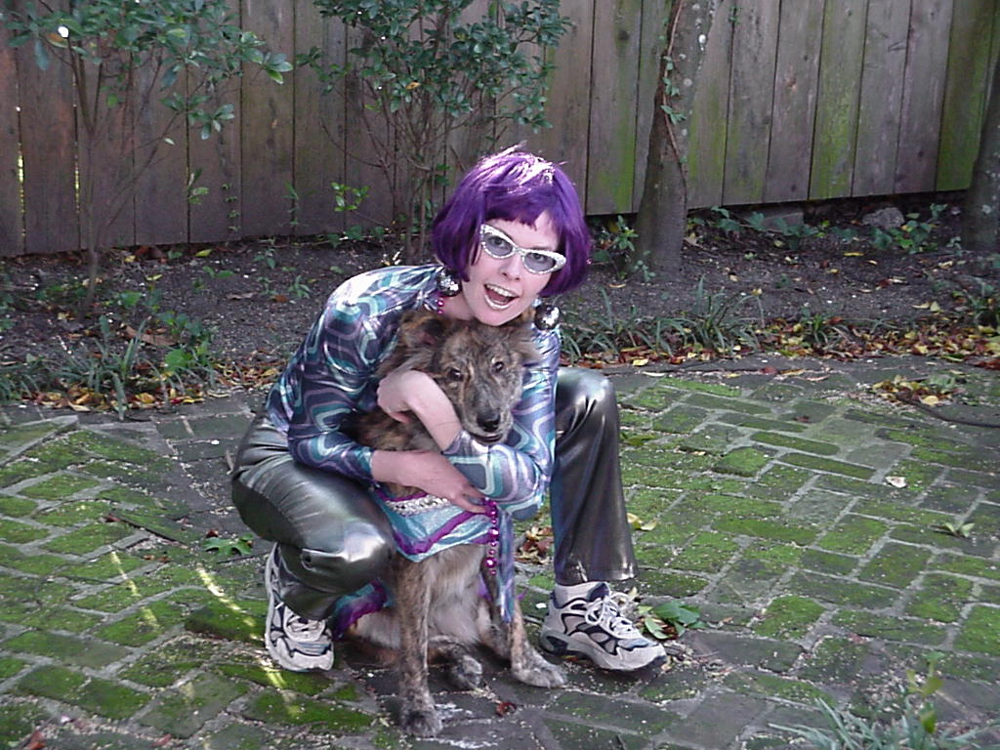

# Halloween scavenger hunt

This is an online Halloween Scavenger Hunt Inspired by and ideas from [Team Buildings Virtual Halloween Party](https://teambuilding.com/blog/virtual-halloween-party).

To participate in this Scavenger Hunt fork this repo, then add in the links or images in the checklist below.

This is designed to be used as a group in something like a virtual team meeting or party.
\* Get your group together and talk about the game.
\* Break into small groups (about 3 people) using something like Zoom break out rooms.
\* Spend about 20 minutes looking for items in the list.
\* Get back together as a team, and share your repos with each other to share what you found.

## Scavenger Hunt

-   [ ] Video of a scare

-   [ ] Funny gravestone

-   [ ] Baby's first Halloween

-   [ ] Dressed up pet

    

-   [ ] A CRAN package in Halloween form

-   [ ] Computer or data related costume

<https://twitter.com/vsbuffalo/status/655589450248945664>

-   [ ] Computer or data related Halloween joke "Why do programmers always mix up Halloween and Christmas?"

"Because Oct 31 = Dec 25." - [ ] Geeky carved pumpkin

<https://twitter.com/_tanho/status/1318168268616597508>

-   [ ] Your new idea
-   [ ] Your other new idea
